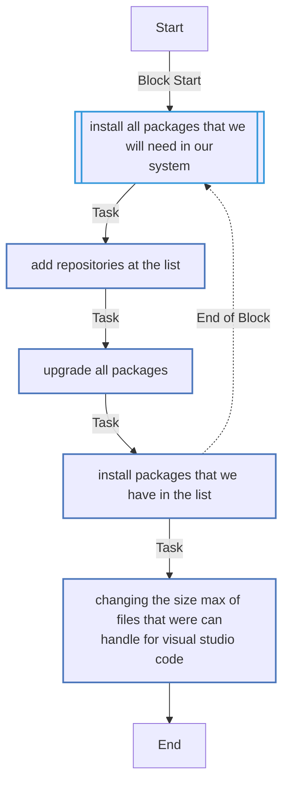
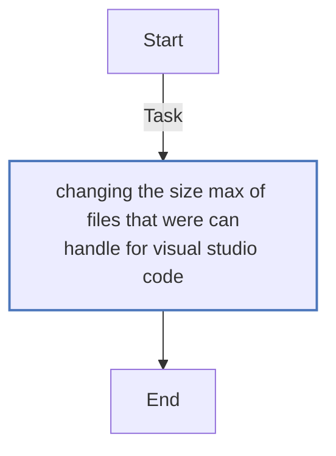

# Setting Up Your System

### **Installing tools and configuring your WorkStation**

With this repository you can install different tools that you need for your WorkStation, this repository will be prepared to install the tools in your Ubuntu, AlmaLinux or Manjaro distribution.

### **Requisites:**

 * Keys pair created and upload to SCM (Source Code Management)
 * Own User created in the Workstation

### **How to use:**

Run the next command in your home:

IMPORTANT: only execute this command the first time, this command is used only because its key pairs (public and private) are already generated in the machine that is being configured

```bash
mkdir SCM; cd SCM; GIT_SSH_COMMAND="ssh -o UserKnownHostsFile=/dev/null -o StrictHostKeyChecking=no"; git clone https://github.com/elsudano/setting-up-your-system
```

Prepare environment with the following command:

```bash
cd setting-up-your-system; chmod 0754 bootstrap.sh; ./bootstrap.sh
```

Delete the file `vault/Common.yml` and name `vault/Common.example` by the previous name, change the values of the variables by the correct data and save the file.

Please you need to do, the same procedure with the others files of the OS.

```bash
rm vault/Common.yml; mv vault/Common.example vault/Common.yml; nano vault/Common.yml
rm vault/Debian.yml; mv vault/Debian.example vault/Debian.yml; nano vault/Debian.yml
...
```

Then execute next command in the root path for to assign a secret encryption and decryption password, ofcourse change the text of *password*.

```bash
echo "password" > vault/credentials.txt
```

Run the next command for add you personal private key to the WorkStation

```bash
touch $HOME/.ssh/id_rsa; chmod 0600 $HOME/.ssh/id_rsa; nano $HOME/.ssh/id_rsa
```

Go to the root path of the project and run the differents targets in order, If you want see the different target in the Makefile only type `make`

Run the following command in order to download the Roles:

```bash
make 02_ansible-check
```

Run the next command in order to install the pre-requisites packages in your environment.

```bash
make 02_ansible-run EXTRA="-l local -t packages"
```

And finally run the following command in order to star with your configuration.

```bash
make 02_ansible-run EXTRA="-l local"
```

In this point of the installation is necessary reboot the VM

### **Dependencies:**

 - geerlingguy.ansible
 - geerlingguy.ntp
 - geerlingguy.docker
 - geerlingguy.pip
 - willshersystems.sshd

### **Author Information:**

Carlos de la Torre (<carlos.ariel.de.la.torre@gmail.com>)

## Variables

###  Role vars
* `ntp_timezone`: In order to configure our NTP protocol we can choose which Time Zone we wantBy Default: Europe/Madrid
* `name_of_workstation`: We can change the name of our WorkstationBy Default: workstation
* `workstation_swapiness`: You can choose which is the value for your SwapinessBy Default is false
* `repo_list`: We can use this variable in order to set all the repositories that we want
* `package_list`: With this variable we can install or remove all the applications that we have or we want in our Workstation
* `workstation_string_of_public_key`: We will need the complete path of our Public Key in order to use our SCM (Source Code Management)
* `workstation_scm_name`: We will need set which is the name that we want in our SCM (Source Code Management)
* `workstation_scm_email`: We will need set which is the email that we want in our SCM (Source Code Management)

### Role defaults (required)
* `ntp_timezone`: In order to configure our NTP protocol we can choose which Time Zone we wantBy Default: Europe/Madrid
* `name_of_workstation`: We can change the name of our WorkstationBy Default: workstation
* `workstation_swapiness`: You can choose which is the value for your SwapinessBy Default is false
* `workstation_username`: In order to set the correct user name and the password we can use these variables
* `workstation_password`: In order to set the correct user name and the password we can use these variables
* `workstation_scm_token`: This variable regarding of Source Code Management is to make easier the connection with the SCM
* `workstation_id_gpg_key`: Value of GpG Key in order to sing your commits you can see which are you IDs with this command
* `workstation_private_key`: We will need the content of our Private Key in order to use our SCM (Source Code Management)

### Role defaults (non-required)
Not role defaults (non-required) found.

<!-- DOCSIBLE START -->

## 📃 Role overview

Description: Customize configuration of your Workstation

### Defaults

**These are static variables with lower priority**

#### File: defaults/main.yml

| Var          | Type         | Value       |Required    | Title       |
|--------------|--------------|-------------|-------------|-------------|
| [ntp_timezone](defaults/main.yml#L5)   | str   | `Europe/Madrid` |    n/a  |  n/a |
| [name_of_workstation](defaults/main.yml#L10)   | str   | `workstation` |    n/a  |  n/a |
| [workstation_id_gpg_key](defaults/main.yml#L17)   | NoneType   | `None` |    n/a  |  n/a |
| [default_user](defaults/main.yml#L21)   | str   | `usuario` |    n/a  |  n/a |
| [workstation_swapiness](defaults/main.yml#L26)   | bool   | `False` |    n/a  |  n/a |
| [default_editor](defaults/main.yml#L31)   | str   | `nano` |    n/a  |  n/a |

### Vars

**These are variables with higher priority**
#### File: vars/Common.yml

| Var          | Type         | Value       |Required    | Title       |
|--------------|--------------|-------------|-------------|-------------|
| [distributions](vars/Common.yml#L4)   | list   | `['Debian', 'RedHat', 'Almalinux']` |    n/a  |  n/a |
| [ntp_timezone](vars/Common.yml#L11)   | str   | `Europe/Madrid` |    n/a  |  n/a |
| [config_system_locale](vars/Common.yml#L16)   | str   | `es_ES.UTF-8` |    n/a  |  n/a |
| [config_system_language](vars/Common.yml#L21)   | str   | `es_ES.UTF-8` |    n/a  |  n/a |
| [default_user](vars/Common.yml#L25)   | str   | `usuario` |    n/a  |  n/a |
| [default_group](vars/Common.yml#L29)   | str   | `usuario` |    n/a  |  n/a |
| [workstation_swapiness](vars/Common.yml#L33)   | bool   | `False` |    n/a  |  n/a |
| [workstation_public_key](vars/Common.yml#L37)   | str   | `<multiline value>` |    n/a  |  n/a |
| [x11vnc_passwd_file](vars/Common.yml#L42)   | str   | `/home/{{ default_user }}/.vnc/passwd` |    n/a  |  n/a |
| [docker_users](vars/Common.yml#L46)   | list   | `['usuario']` |    n/a  |  n/a |
| [resolve_conf_file_options](vars/Common.yml#L53)   | list   | `['nameserver 127.0.0.1', 'options edns0 trust-ad']` |    n/a  |  n/a |
| [fw_ports](vars/Common.yml#L60)   | list   | `['22/tcp', '5432/tcp', '5601/tcp', '5900/tcp', '9200/tcp', '16443/tcp', '24231/tcp', '25000/tcp', '19001/tcp']` |    n/a  |  n/a |
#### File: vars/RedHat.yml

| Var          | Type         | Value       |Required    | Title       |
|--------------|--------------|-------------|-------------|-------------|
| [package_list](vars/RedHat.yml#L4)   | list   | `[{'state': 'present', 'packages': ['terraform']}, {'state': 'absent', 'packages': ['vim']}]` |    n/a  |  n/a |
#### File: vars/Debian.yml

| Var          | Type         | Value       |Required    | Title       |
|--------------|--------------|-------------|-------------|-------------|
| [repo_list](vars/Debian.yml#L4)   | list   | `[{'state': 'present', 'repo': 'deb [arch=amd64] https://packages.microsoft.com/repos/vscode stable main', 'filename': 'code-studio', 'repo_key': 'https://packages.microsoft.com/keys/microsoft.asc'}, {'state': 'present', 'repo': 'deb [arch=amd64] https://apt.kubernetes.io/ kubernetes-xenial main', 'filename': 'kubernetes'}, {'state': 'present', 'repo': 'deb [arch=amd64] https://apt.releases.hashicorp.com jammy main', 'filename': 'hashicorp'}, {'state': 'present', 'repo': 'deb [arch=amd64] http://dl.google.com/linux/chrome/deb/ stable main', 'filename': 'google', 'repo_key': 'https://dl.google.com/linux/linux_signing_key.pub'}, {'state': 'present', 'repo': 'deb https://packages.cloud.google.com/apt cloud-sdk main', 'filename': 'google-sdk'}, {'state': 'present', 'repo': 'deb https://ppa.launchpadcontent.net/mozillateam/ppa/ubuntu/ jammy main', 'filename': 'mozilla'}]` |    n/a  |  n/a |
| [package_list](vars/Debian.yml#L33)   | list   | `[{'state': 'present', 'packages': ['apt-transport-https', 'apt-transport-s3', 'kio-gdrive', 'network-manager-openvpn', 'ca-certificates', 'curl', 'yakuake', 'code', 'net-tools', 'atop', 'kubectl', 'terraform', 'firefox', 'thunderbird', 'google-chrome-stable', 'google-cloud-cli', 'git', 'gnupg2', 'rng-tools', 'jq', 'ark', 'tree', 'x11vnc', 'libreoffice', 'golang-go', 'dnsmasq']}, {'state': 'absent', 'packages': ['muon', 'snapd']}]` |    n/a  |  n/a |
| [go_programs](vars/Debian.yml#L67)   | list   | `['github.com/gopasspw/gopass@latest']` |    n/a  |  n/a |
| [list_with_keys_to_load](vars/Debian.yml#L70)   | list   | `['~/.ssh/id_rsa']` |    n/a  |  n/a |
#### File: vars/AlmaLinux.yml

| Var          | Type         | Value       |Required    | Title       |
|--------------|--------------|-------------|-------------|-------------|
| [repo_list](vars/AlmaLinux.yml#L3)   | list   | `[{'description': 'Visual Studio Code', 'filename': 'code-studio', 'repo': 'https://packages.microsoft.com/yumrepos/vscode/', 'metalink': '', 'repo_key': 'https://packages.microsoft.com/keys/microsoft.asc', 'enabled': True, 'gpgcheck': False, 'repo_gpgcheck': False, 'metadata_expire': '1h'}, {'description': 'ELRepo.org Community Enterprise Linux Repository - el9', 'filename': 'elrepo', 'repo': 'http://elrepo.org/linux/elrepo/el9/$basearch/ http://mirrors.coreix.net/elrepo/elrepo/el9/$basearch/ http://mirror.rackspace.com/elrepo/elrepo/el9/$basearch/ http://linux-mirrors.fnal.gov/linux/elrepo/elrepo/el9/$basearch/', 'metalink': 'http://mirrors.elrepo.org/mirrors-elrepo.el9', 'enabled': True, 'gpgcheck': True, 'repo_gpgcheck': False, 'repo_key': 'file:///etc/pki/rpm-gpg/RPM-GPG-KEY-elrepo.org', 'metadata_expire': '1h'}, {'description': 'Extra Packages for Enterprise Linux $releasever - Next - $basearch', 'filename': 'epel-next', 'repo': 'https://download.example/pub/epel/next/$releasever/Everything/$basearch/', 'metalink': 'https://mirrors.fedoraproject.org/metalink?repo=epel-next-$releasever&arch=$basearch&infra=$infra&content=$contentdir', 'enabled': True, 'gpgcheck': True, 'repo_gpgcheck': False, 'repo_key': 'file:///etc/pki/rpm-gpg/RPM-GPG-KEY-EPEL-$releasever', 'metadata_expire': '1h'}, {'description': 'AlmaLinux-$releasever-CRB', 'filename': 'almalinux-CRB', 'repo': 'https://repo.almalinux.org/almalinux/9.0/CRB/x86_64/os/', 'metalink': '', 'repo_key': 'file:///etc/pki/rpm-gpg/RPM-GPG-KEY-AlmaLinux-9', 'enabled': True, 'gpgcheck': False, 'repo_gpgcheck': False, 'metadata_expire': '1h'}, {'description': 'RPM Fusion for EL 9 Free Updates', 'filename': 'rpmfusion-free-updates', 'repo': 'http://download1.rpmfusion.org/free/el/updates/9/$basearch/', 'metalink': 'http://mirrors.rpmfusion.org/metalink?repo=free-el-updates-released-9&arch=$basearch', 'repo_key': 'file:///etc/pki/rpm-gpg/RPM-GPG-KEY-rpmfusion-free-el-9', 'enabled': True, 'gpgcheck': False, 'repo_gpgcheck': False, 'metadata_expire': '1h'}, {'description': 'RPM Fusion for EL 9 Nonfree Updates', 'filename': 'rpmfusion-nonfree-updates', 'repo': 'http://download1.rpmfusion.org/nonfree/el/updates/9/$basearch/', 'metalink': 'http://mirrors.rpmfusion.org/metalink?repo=nonfree-el-updates-released-9&arch=$basearch', 'repo_key': 'file:///etc/pki/rpm-gpg/RPM-GPG-KEY-rpmfusion-nonfree-el-9', 'enabled': True, 'gpgcheck': True, 'repo_gpgcheck': False, 'metadata_expire': '1h'}, {'description': 'Google Chrome repository', 'filename': 'google-chrome', 'repo': 'http://dl.google.com/linux/chrome/rpm/stable/$basearch', 'metalink': '', 'repo_key': 'https://dl.google.com/linux/linux_signing_key.pub', 'enabled': True, 'gpgcheck': False, 'repo_gpgcheck': False, 'metadata_expire': '1h'}]` |    n/a  |  n/a |
| [package_list](vars/AlmaLinux.yml#L75)   | list   | `[{'state': 'present', 'packages': ['yum-utils', 'htop', 'bash-completion', 'glibc-common', 'glibc-locale-source', 'glibc-langpack-es', 'NetworkManager-openvpn', 'ca-certificates', 'curl', 'yakuake', 'code', 'net-tools', 'atop', 'kubectl', 'firefox', 'thunderbird', 'google-chrome-stable', 'google-cloud-cli', 'git', 'gnupg2', 'rng-tools', 'kde-partitionmanager', 'jq', 'ark', 'tree', 'x11vnc', 'libreoffice-writer', 'libreoffice-calc', 'golang', 'dnsmasq', 'vlc', 'ffmpeg', 'ffmpeg-devel']}, {'state': 'absent', 'packages': ['vim']}]` |    n/a  |  n/a |
| [list_with_keys_to_load](vars/AlmaLinux.yml#L119)   | list   | `['/home/usuario/.ssh/id_rsa']` |    n/a  |  n/a |
#### File: vars/Ubuntu.yml

| Var          | Type         | Value       |Required    | Title       |
|--------------|--------------|-------------|-------------|-------------|
| [install_microk8s](vars/Ubuntu.yml#L4)   | bool   | `False` |    n/a  |  n/a |
| [repo_list](vars/Ubuntu.yml#L8)   | list   | `[{'state': 'present', 'repo': 'deb [arch=amd64] https://packages.microsoft.com/repos/vscode stable main', 'filename': 'code-studio', 'repo_key': 'https://packages.microsoft.com/keys/microsoft.asc'}, {'state': 'present', 'repo': 'deb [arch=amd64] https://apt.kubernetes.io/ kubernetes-xenial main', 'filename': 'kubernetes'}, {'state': 'present', 'repo': 'deb [arch=amd64] https://apt.releases.hashicorp.com jammy main', 'filename': 'hashicorp'}, {'state': 'present', 'repo': 'deb [arch=amd64] http://dl.google.com/linux/chrome/deb/ stable main', 'filename': 'google', 'repo_key': 'https://dl.google.com/linux/linux_signing_key.pub'}, {'state': 'present', 'repo': 'deb https://packages.cloud.google.com/apt cloud-sdk main', 'filename': 'google-sdk', 'repo_key': 'https://packages.cloud.google.com/apt/doc/apt-key.gpg'}, {'state': 'present', 'repo': 'deb https://ppa.launchpadcontent.net/mozillateam/ppa/ubuntu/ jammy main', 'filename': 'mozilla'}]` |    n/a  |  n/a |
| [package_list](vars/Ubuntu.yml#L38)   | list   | `[{'state': 'present', 'packages': ['atop', 'python3-passlib', 'apt-transport-https', 'apt-transport-s3', 'ca-certificates', 'curl', 'net-tools', 'git', 'golang-go', 'gnupg2', 'jq', 'tree', 'dnsmasq', 'nano', 'make', 'python3.10-venv', 'python3-firewall', 'firewalld', 'x11vnc']}, {'state': 'absent', 'packages': ['muon', 'snapd']}]` |    n/a  |  n/a |
| [list_with_keys_to_load](vars/Ubuntu.yml#L68)   | list   | `['~/.ssh/id_rsa']` |    n/a  |  n/a |
#### File: vars/Archlinux.yml

| Var          | Type         | Value       |Required    | Title       |
|--------------|--------------|-------------|-------------|-------------|
| [package_list](vars/Archlinux.yml#L3)   | list   | `[{'state': 'present', 'packages': ['htop', 'bash-completion', 'net-tools', 'atop', 'git', 'gnupg', 'jq', 'tree', 'go', 'dnsmasq', 'firewalld', 'iptables-persistent', 'snapd']}, {'state': 'absent', 'packages': None}]` |    n/a  |  n/a |
| [go_programs](vars/Archlinux.yml#L23)   | list   | `['github.com/goreleaser/goreleaser@latest']` |    n/a  |  n/a |
| [list_with_keys_to_load](vars/Archlinux.yml#L26)   | list   | `['/home/usuario/.ssh/id_rsa']` |    n/a  |  n/a |
| [docker_packages](vars/Archlinux.yml#L29)   | list   | `['docker', 'docker-cli-bin', 'docker-rootless-extras']` |    n/a  |  n/a |
| [docker_packages_state](vars/Archlinux.yml#L33)   | str   | `present` |    n/a  |  n/a |
| [docker_install_compose](vars/Archlinux.yml#L34)   | bool   | `True` |    n/a  |  n/a |
| [docker_users](vars/Archlinux.yml#L35)   | list   | `['{{ default_user }}']` |    n/a  |  n/a |

### Tasks

#### File: tasks/setup-AlmaLinux.yml

| Name | Module | Has Conditions |
| ---- | ------ | --------- |
| Install all packages that we will need in our system | block | False |
| Add repositories at the list | ansible.builtin.yum_repository | False |
| Upgrade all packages | ansible.builtin.dnf | False |
| Install packages that we have in the list | ansible.builtin.dnf | False |
| Changing the size max of files that were can handle for Visual Studio Code | lineinfile | False |

#### File: tasks/setup-RedHat.yml

| Name | Module | Has Conditions |
| ---- | ------ | --------- |
| Changing the size max of files that were can handle for Visual Studio Code | lineinfile | False |

#### File: tasks/setup-Debian.yml

| Name | Module | Has Conditions |
| ---- | ------ | --------- |
| Upgrade all packages to the latest version (Debian) | apt | False |
| Unnamed |  | False |
| Change configuration for to be able change name of VM (Debian) | lineinfile | True |
| All related to install packages | block | False |
| Add an Apt signing key, uses whichever key is at the URL | apt_key | True |
| Set all the repositories that we need to install all the tools that we use. | ansible.builtin.apt_repository | True |
| Install and Remove the Custom Packages that we want | apt | False |
| Changing the size max of files that were can handle for Visual Studio Code | lineinfile | False |
| All releated with the services | block | False |
| Ensure sshd service is enabled and running | service | False |
| Ensure atop service is enabled and running | service | False |
| Setting all the things to Microk8s start automatically | block | True |
| Ensure that Cluster Agent service is enabled and running | service | True |
| Ensure that Containerd service is enabled and running | service | True |
| Ensure that K8-Dqlite service is enabled and running | service | True |
| Ensure that Kubelite service is enabled and running | service | True |
| Ensure that ApiServer-Kicker service is enabled and running | service | True |

#### File: tasks/setup-Archlinux.yml

| Name | Module | Has Conditions |
| ---- | ------ | --------- |
| Install docker in Manjaro | include_role | False |
| Install all packages that we will need in our system | block | False |
| Upgrade all packages | community.general.pacman | False |
| Install YAY in our system | community.general.pacman | True |
| Install packages that we have in the list | command | True |
| Remove packages that we have in the list | command | True |
| Setting all the things to Microk8s start automatically | block | False |
| Create a .kube folder | file | False |
| Ensure that SnapD is available | service | True |
| Create a Snap symbolic link | file | False |
| Install "Microk8s" with option --classic | snap | False |
| Ensure that Cluster Agent service is enabled and running | service | True |
| Ensure that Containerd service is enabled and running | service | True |
| Ensure that K8-Dqlite service is enabled and running | service | True |
| Ensure that Kubelite service is enabled and running | service | True |
| Ensure that ApiServer-Kicker service is enabled and running | service | True |
| Changing the size max of files that were can handle for Visual Studio Code | lineinfile | False |

#### File: tasks/setup-Common.yml

| Name | Module | Has Conditions |
| ---- | ------ | --------- |
| Change the name of VM (Debian) | hostname | True |
| Change a usuario password | user | False |
| Colorized prompt | replace | False |
| All the configurations for GIT | block | False |
| Configure your full name for Git configuration | git_config | False |
| Configure your email for Git configuration | git_config | False |
| Configure your default editor for Git configuration | git_config | False |
| Configure git protocol by default instead of http | git_config | True |
| We are configure the logrotate | block | False |
| Set default logrotate configuration | template | False |
| Set wtmp logrotate configuration | template | False |
| Set btmp logrotate configuration | template | False |
| Set swappines | sysctl | True |
| All releated with SCM and SSH | block | False |
| Enable the SSH-AGENT in the user session | blockinfile | False |
| Load all the KEYs when user init session | lineinfile | False |
| Adding basic configuration to .bashrc (Debian) | blockinfile | False |
| We are creating a new file in order to allow run commands in sudo mode at the user | copy | False |
| Create a file for AutoComplete Kubectl | blockinfile | False |
| Create a file for AutoComplete Terraform | blockinfile | False |
| Create a file for AutoComplete GoPass | blockinfile | False |
| Create a file for AutoComplete Molecule | blockinfile | False |
| Create a file for AutoComplete Helm | blockinfile | False |
| All releated with SCM and SSH | block | False |
| We going to create a SSH folder to save the files | file | False |
| Add you PRIVATE key to a file in your home | copy | False |
| Add you public key to a file in your home | copy | False |
| Add public key to authorized_hosts file for connect remotely (Debian) | authorized_key | False |
| Ensure that the SSH daemon is correctly configure | block | False |
| Ensure to send SSH client keep alive before firewalls cut the connection | lineinfile | False |
| Ensure to terminate SSH sessions with unresponsive clients | lineinfile | False |
| All releated with SCM and GPG | block | False |
| Configure gpgsing for Git configuration | git_config | False |
| Configure gpg program for Git configuration | git_config | False |
| Configure your ID gpg Key for Git configuration | git_config | False |
| Setting all the things to connect from out of the instance | block | False |
| Setting the correct interpreter of python | set_fact | False |
| Open requiered port in FirewallD | ansible.posix.firewalld | True |
| Enable some protocols in Firewalld | ansible.posix.firewalld | True |
| Reload and restart service FirewallD | ansible.builtin.systemd | True |
| Disable IPv6 for all interfaces | sysctl | False |
| Setting all the things to connect remotelly by X11Vnc | block | True |
| We have created the file with the service of X11Vnc | template | False |
| We going to create a VNC folder to save the files | file | False |
| Setting the password for X11Vnc | command | False |
| Ensure that X11Vnc service is enabled and running | service | True |
| Setting all the configurations for GO-LANG | block | False |
| We are setting the GOROOT variable. | blockinfile | False |
| Install all programs by go. | command | True |
| Configuring all the commands that we want in our Workstation | block | False |
| Setting the correct interpreter of python | set_fact | False |
| Copy file of function to work with the cloud (GCP, AWS, AZURE) | template | False |
| Copy file of function other_functions to the home directory | template | False |
| Copy file of function generate_shadow_hash to the home directory | template | False |
| Copy file with functions of keepassxc to the home directory | template | False |
| Copy file of with all alias commands to the home directory | template | False |
| Adding all the functions to .bashrc | blockinfile | False |
| Configuring all the things to dnsmasq | block | True |
| Populate service facts | service_facts | False |
| Disabled the systemd-resolv.service | service | True |
| Enabled the dnsmasq.service | service | True |

## Task Flow Graphs

If you want to review the diagrams, please use this URL https://mermaid.live/

### Graph for setup-AlmaLinux.yml



### Graph for setup-RedHat.yml



### Graph for setup-Debian.yml

```mermaid
flowchart TD
Start
classDef block stroke:#3498db,stroke-width:2px;
classDef task stroke:#4b76bb,stroke-width:2px;
classDef includeTasks stroke:#16a085,stroke-width:2px;
classDef importTasks stroke:#34495e,stroke-width:2px;
classDef includeRole stroke:#2980b9,stroke-width:2px;
classDef importRole stroke:#699ba7,stroke-width:2px;
classDef includeVars stroke:#8e44ad,stroke-width:2px;
classDef rescue stroke:#665352,stroke-width:2px;

  Start-->|Task| Upgrade_all_packages_to_the_latest_version__Debian_0[upgrade all packages to the latest version  debian<br>]:::task
  Upgrade_all_packages_to_the_latest_version__Debian_0-->|Task| Unnamed_task_11[unnamed task 1]:::task
  Unnamed_task_11-->|Task| Change_configuration_for_to_be_able_change_name_of_VM__Debian_2[change configuration for to be able change name of<br>vm  debian <br>When: **config file stat exists and   wsl  not in ansible<br>kernel**]:::task
  Change_configuration_for_to_be_able_change_name_of_VM__Debian_2-->|Block Start| All_related_to_install_packages3_block_start_0[[all related to install packages]]:::block
  All_related_to_install_packages3_block_start_0-->|Task| Add_an_Apt_signing_key__uses_whichever_key_is_at_the_URL0[add an apt signing key  uses whichever key is at<br>the url<br>When: **item repo key   default     true    trim**]:::task
  Add_an_Apt_signing_key__uses_whichever_key_is_at_the_URL0-->|Task| Set_all_the_repositories_that_we_need_to_install_all_the_tools_that_we_use_1[set all the repositories that we need to install<br>all the tools that we use <br>When: **wsl  not in ansible kernel**]:::task
  Set_all_the_repositories_that_we_need_to_install_all_the_tools_that_we_use_1-->|Task| Install_and_Remove_the_Custom_Packages_that_we_want2[install and remove the custom packages that we<br>want]:::task
  Install_and_Remove_the_Custom_Packages_that_we_want2-.->|End of Block| All_related_to_install_packages3_block_start_0
  Install_and_Remove_the_Custom_Packages_that_we_want2-->|Task| Changing_the_size_max_of_files_that_were_can_handle_for_Visual_Studio_Code4[changing the size max of files that were can<br>handle for visual studio code]:::task
  Changing_the_size_max_of_files_that_were_can_handle_for_Visual_Studio_Code4-->|Block Start| All_releated_with_the_services5_block_start_0[[all releated with the services]]:::block
  All_releated_with_the_services5_block_start_0-->|Task| Ensure_sshd_service_is_enabled_and_running0[ensure sshd service is enabled and running]:::task
  Ensure_sshd_service_is_enabled_and_running0-->|Task| Ensure_atop_service_is_enabled_and_running1[ensure atop service is enabled and running]:::task
  Ensure_atop_service_is_enabled_and_running1-.->|End of Block| All_releated_with_the_services5_block_start_0
  Ensure_atop_service_is_enabled_and_running1-->|Block Start| Setting_all_the_things_to_Microk8s_start_automatically6_block_start_0[[setting all the things to microk8s start<br>automatically<br>When: **wsl  not in ansible kernel and install microk8s**]]:::block
  Setting_all_the_things_to_Microk8s_start_automatically6_block_start_0-->|Task| Ensure_that_Cluster_Agent_service_is_enabled_and_running0[ensure that cluster agent service is enabled and<br>running<br>When: **ansible check mode    false**]:::task
  Ensure_that_Cluster_Agent_service_is_enabled_and_running0-->|Task| Ensure_that_Containerd_service_is_enabled_and_running1[ensure that containerd service is enabled and<br>running<br>When: **ansible check mode    false**]:::task
  Ensure_that_Containerd_service_is_enabled_and_running1-->|Task| Ensure_that_K8_Dqlite_service_is_enabled_and_running2[ensure that k8 dqlite service is enabled and<br>running<br>When: **ansible check mode    false**]:::task
  Ensure_that_K8_Dqlite_service_is_enabled_and_running2-->|Task| Ensure_that_Kubelite_service_is_enabled_and_running3[ensure that kubelite service is enabled and<br>running<br>When: **ansible check mode    false**]:::task
  Ensure_that_Kubelite_service_is_enabled_and_running3-->|Task| Ensure_that_ApiServer_Kicker_service_is_enabled_and_running4[ensure that apiserver kicker service is enabled<br>and running<br>When: **ansible check mode    false**]:::task
  Ensure_that_ApiServer_Kicker_service_is_enabled_and_running4-.->|End of Block| Setting_all_the_things_to_Microk8s_start_automatically6_block_start_0
  Ensure_that_ApiServer_Kicker_service_is_enabled_and_running4-->End
```



### Graph for setup-Archlinux.yml

```mermaid
flowchart TD
Start
classDef block stroke:#3498db,stroke-width:2px;
classDef task stroke:#4b76bb,stroke-width:2px;
classDef includeTasks stroke:#16a085,stroke-width:2px;
classDef importTasks stroke:#34495e,stroke-width:2px;
classDef includeRole stroke:#2980b9,stroke-width:2px;
classDef importRole stroke:#699ba7,stroke-width:2px;
classDef includeVars stroke:#8e44ad,stroke-width:2px;
classDef rescue stroke:#665352,stroke-width:2px;

  Start-->|Include role| geerlingguy_docker0(install docker in manjaro<br>include_role: geerlingguy docker):::includeRole
  geerlingguy_docker0-->|Block Start| Install_all_packages_that_we_will_need_in_our_system1_block_start_0[[install all packages that we will need in our<br>system]]:::block
  Install_all_packages_that_we_will_need_in_our_system1_block_start_0-->|Task| Upgrade_all_packages0[upgrade all packages]:::task
  Upgrade_all_packages0-->|Task| Install_YAY_in_our_system1[install yay in our system<br>When: **ansible pkg mgr     pacman**]:::task
  Install_YAY_in_our_system1-->|Task| Install_packages_that_we_have_in_the_list2[install packages that we have in the list<br>When: **item state     present  and item packages 0 is<br>defined**]:::task
  Install_packages_that_we_have_in_the_list2-->|Task| Remove_packages_that_we_have_in_the_list3[remove packages that we have in the list<br>When: **item state     absent  and item packages 0 is<br>defined**]:::task
  Remove_packages_that_we_have_in_the_list3-.->|End of Block| Install_all_packages_that_we_will_need_in_our_system1_block_start_0
  Remove_packages_that_we_have_in_the_list3-->|Block Start| Setting_all_the_things_to_Microk8s_start_automatically2_block_start_0[[setting all the things to microk8s start<br>automatically]]:::block
  Setting_all_the_things_to_Microk8s_start_automatically2_block_start_0-->|Task| Create_a__kube_folder0[create a  kube folder]:::task
  Create_a__kube_folder0-->|Task| Ensure_that_SnapD_is_available1[ensure that snapd is available<br>When: **ansible check mode    false**]:::task
  Ensure_that_SnapD_is_available1-->|Task| Create_a_Snap_symbolic_link2[create a snap symbolic link]:::task
  Create_a_Snap_symbolic_link2-->|Task| Install__Microk8s__with_option___classic3[install  microk8s  with option   classic]:::task
  Install__Microk8s__with_option___classic3-->|Task| Ensure_that_Cluster_Agent_service_is_enabled_and_running4[ensure that cluster agent service is enabled and<br>running<br>When: **ansible check mode    false**]:::task
  Ensure_that_Cluster_Agent_service_is_enabled_and_running4-->|Task| Ensure_that_Containerd_service_is_enabled_and_running5[ensure that containerd service is enabled and<br>running<br>When: **ansible check mode    false**]:::task
  Ensure_that_Containerd_service_is_enabled_and_running5-->|Task| Ensure_that_K8_Dqlite_service_is_enabled_and_running6[ensure that k8 dqlite service is enabled and<br>running<br>When: **ansible check mode    false**]:::task
  Ensure_that_K8_Dqlite_service_is_enabled_and_running6-->|Task| Ensure_that_Kubelite_service_is_enabled_and_running7[ensure that kubelite service is enabled and<br>running<br>When: **ansible check mode    false**]:::task
  Ensure_that_Kubelite_service_is_enabled_and_running7-->|Task| Ensure_that_ApiServer_Kicker_service_is_enabled_and_running8[ensure that apiserver kicker service is enabled<br>and running<br>When: **ansible check mode    false**]:::task
  Ensure_that_ApiServer_Kicker_service_is_enabled_and_running8-.->|End of Block| Setting_all_the_things_to_Microk8s_start_automatically2_block_start_0
  Ensure_that_ApiServer_Kicker_service_is_enabled_and_running8-->|Task| Changing_the_size_max_of_files_that_were_can_handle_for_Visual_Studio_Code3[changing the size max of files that were can<br>handle for visual studio code]:::task
  Changing_the_size_max_of_files_that_were_can_handle_for_Visual_Studio_Code3-->End
```



### Graph for setup-Common.yml

```mermaid
flowchart TD
Start
classDef block stroke:#3498db,stroke-width:2px;
classDef task stroke:#4b76bb,stroke-width:2px;
classDef includeTasks stroke:#16a085,stroke-width:2px;
classDef importTasks stroke:#34495e,stroke-width:2px;
classDef includeRole stroke:#2980b9,stroke-width:2px;
classDef importRole stroke:#699ba7,stroke-width:2px;
classDef includeVars stroke:#8e44ad,stroke-width:2px;
classDef rescue stroke:#665352,stroke-width:2px;

  Start-->|Task| Change_the_name_of_VM__Debian_0[change the name of vm  debian <br>When: **wsl  not in ansible kernel**]:::task
  Change_the_name_of_VM__Debian_0-->|Task| Change_a_usuario_password1[change a usuario password]:::task
  Change_a_usuario_password1-->|Task| Colorized_prompt2[colorized prompt]:::task
  Colorized_prompt2-->|Block Start| All_the_configurations_for_GIT3_block_start_0[[all the configurations for git]]:::block
  All_the_configurations_for_GIT3_block_start_0-->|Task| Configure_your_full_name_for_Git_configuration0[configure your full name for git configuration]:::task
  Configure_your_full_name_for_Git_configuration0-->|Task| Configure_your_email_for_Git_configuration1[configure your email for git configuration]:::task
  Configure_your_email_for_Git_configuration1-->|Task| Configure_your_default_editor_for_Git_configuration2[configure your default editor for git<br>configuration]:::task
  Configure_your_default_editor_for_Git_configuration2-->|Task| Configure_git_protocol_by_default_instead_of_http3[configure git protocol by default instead of http<br>When: **git protol original is defined and git protol<br>replaceby is defined**]:::task
  Configure_git_protocol_by_default_instead_of_http3-.->|End of Block| All_the_configurations_for_GIT3_block_start_0
  Configure_git_protocol_by_default_instead_of_http3-->|Block Start| We_are_configure_the_logrotate4_block_start_0[[we are configure the logrotate]]:::block
  We_are_configure_the_logrotate4_block_start_0-->|Task| Set_default_logrotate_configuration0[set default logrotate configuration]:::task
  Set_default_logrotate_configuration0-->|Task| Set_wtmp_logrotate_configuration1[set wtmp logrotate configuration]:::task
  Set_wtmp_logrotate_configuration1-->|Task| Set_btmp_logrotate_configuration2[set btmp logrotate configuration]:::task
  Set_btmp_logrotate_configuration2-.->|End of Block| We_are_configure_the_logrotate4_block_start_0
  Set_btmp_logrotate_configuration2-->|Task| Set_swappines5[set swappines<br>When: **workstation swapiness    false**]:::task
  Set_swappines5-->|Block Start| All_releated_with_SCM_and_SSH6_block_start_0[[all releated with scm and ssh]]:::block
  All_releated_with_SCM_and_SSH6_block_start_0-->|Task| Enable_the_SSH_AGENT_in_the_user_session0[enable the ssh agent in the user session]:::task
  Enable_the_SSH_AGENT_in_the_user_session0-->|Task| Load_all_the_KEYs_when_user_init_session1[load all the keys when user init session]:::task
  Load_all_the_KEYs_when_user_init_session1-->|Task| Adding_basic_configuration_to__bashrc__Debian_2[adding basic configuration to  bashrc  debian ]:::task
  Adding_basic_configuration_to__bashrc__Debian_2-->|Task| We_are_creating_a_new_file_in_order_to_allow_run_commands_in_sudo_mode_at_the_user3[we are creating a new file in order to allow run<br>commands in sudo mode at the user]:::task
  We_are_creating_a_new_file_in_order_to_allow_run_commands_in_sudo_mode_at_the_user3-->|Task| Create_a_file_for_AutoComplete_Kubectl4[create a file for autocomplete kubectl]:::task
  Create_a_file_for_AutoComplete_Kubectl4-->|Task| Create_a_file_for_AutoComplete_Terraform5[create a file for autocomplete terraform]:::task
  Create_a_file_for_AutoComplete_Terraform5-->|Task| Create_a_file_for_AutoComplete_GoPass6[create a file for autocomplete gopass]:::task
  Create_a_file_for_AutoComplete_GoPass6-->|Task| Create_a_file_for_AutoComplete_Molecule7[create a file for autocomplete molecule]:::task
  Create_a_file_for_AutoComplete_Molecule7-->|Task| Create_a_file_for_AutoComplete_Helm8[create a file for autocomplete helm]:::task
  Create_a_file_for_AutoComplete_Helm8-.->|End of Block| All_releated_with_SCM_and_SSH6_block_start_0
  Create_a_file_for_AutoComplete_Helm8-->|Block Start| All_releated_with_SCM_and_SSH7_block_start_0[[all releated with scm and ssh]]:::block
  All_releated_with_SCM_and_SSH7_block_start_0-->|Task| We_going_to_create_a_SSH_folder_to_save_the_files0[we going to create a ssh folder to save the files]:::task
  We_going_to_create_a_SSH_folder_to_save_the_files0-->|Task| Add_you_PRIVATE_key_to_a_file_in_your_home1[add you private key to a file in your home]:::task
  Add_you_PRIVATE_key_to_a_file_in_your_home1-->|Task| Add_you_public_key_to_a_file_in_your_home2[add you public key to a file in your home]:::task
  Add_you_public_key_to_a_file_in_your_home2-->|Task| Add_public_key_to_authorized_hosts_file_for_connect_remotely__Debian_3[add public key to authorized hosts file for<br>connect remotely  debian ]:::task
  Add_public_key_to_authorized_hosts_file_for_connect_remotely__Debian_3-.->|End of Block| All_releated_with_SCM_and_SSH7_block_start_0
  Add_public_key_to_authorized_hosts_file_for_connect_remotely__Debian_3-->|Block Start| Ensure_that_the_SSH_daemon_is_correctly_configure8_block_start_0[[ensure that the ssh daemon is correctly configure]]:::block
  Ensure_that_the_SSH_daemon_is_correctly_configure8_block_start_0-->|Task| Ensure_to_send_SSH_client_keep_alive_before_firewalls_cut_the_connection0[ensure to send ssh client keep alive before<br>firewalls cut the connection]:::task
  Ensure_to_send_SSH_client_keep_alive_before_firewalls_cut_the_connection0-->|Task| Ensure_to_terminate_SSH_sessions_with_unresponsive_clients1[ensure to terminate ssh sessions with unresponsive<br>clients]:::task
  Ensure_to_terminate_SSH_sessions_with_unresponsive_clients1-.->|End of Block| Ensure_that_the_SSH_daemon_is_correctly_configure8_block_start_0
  Ensure_to_terminate_SSH_sessions_with_unresponsive_clients1-->|Block Start| All_releated_with_SCM_and_GPG9_block_start_0[[all releated with scm and gpg]]:::block
  All_releated_with_SCM_and_GPG9_block_start_0-->|Task| Configure_gpgsing_for_Git_configuration0[configure gpgsing for git configuration]:::task
  Configure_gpgsing_for_Git_configuration0-->|Task| Configure_gpg_program_for_Git_configuration1[configure gpg program for git configuration]:::task
  Configure_gpg_program_for_Git_configuration1-->|Task| Configure_your_ID_gpg_Key_for_Git_configuration2[configure your id gpg key for git configuration]:::task
  Configure_your_ID_gpg_Key_for_Git_configuration2-.->|End of Block| All_releated_with_SCM_and_GPG9_block_start_0
  Configure_your_ID_gpg_Key_for_Git_configuration2-->|Block Start| Setting_all_the_things_to_connect_from_out_of_the_instance10_block_start_0[[setting all the things to connect from out of the<br>instance]]:::block
  Setting_all_the_things_to_connect_from_out_of_the_instance10_block_start_0-->|Task| Setting_the_correct_interpreter_of_python0[setting the correct interpreter of python]:::task
  Setting_the_correct_interpreter_of_python0-->|Task| Open_requiered_port_in_FirewallD1[open requiered port in firewalld<br>When: **fw ports is defined**]:::task
  Open_requiered_port_in_FirewallD1-->|Task| Enable_some_protocols_in_Firewalld2[enable some protocols in firewalld<br>When: **fw proto is defined**]:::task
  Enable_some_protocols_in_Firewalld2-->|Task| Reload_and_restart_service_FirewallD3[reload and restart service firewalld<br>When: **change firewall config is changed**]:::task
  Reload_and_restart_service_FirewallD3-->|Task| Disable_IPv6_for_all_interfaces4[disable ipv6 for all interfaces]:::task
  Disable_IPv6_for_all_interfaces4-.->|End of Block| Setting_all_the_things_to_connect_from_out_of_the_instance10_block_start_0
  Disable_IPv6_for_all_interfaces4-->|Block Start| Setting_all_the_things_to_connect_remotelly_by_X11Vnc11_block_start_0[[setting all the things to connect remotelly by<br>x11vnc<br>When: **wsl  not in ansible kernel**]]:::block
  Setting_all_the_things_to_connect_remotelly_by_X11Vnc11_block_start_0-->|Task| We_have_created_the_file_with_the_service_of_X11Vnc0[we have created the file with the service of<br>x11vnc]:::task
  We_have_created_the_file_with_the_service_of_X11Vnc0-->|Task| We_going_to_create_a_VNC_folder_to_save_the_files1[we going to create a vnc folder to save the files]:::task
  We_going_to_create_a_VNC_folder_to_save_the_files1-->|Task| Setting_the_password_for_X11Vnc2[setting the password for x11vnc]:::task
  Setting_the_password_for_X11Vnc2-->|Task| Ensure_that_X11Vnc_service_is_enabled_and_running3[ensure that x11vnc service is enabled and running<br>When: **ansible check mode    false**]:::task
  Ensure_that_X11Vnc_service_is_enabled_and_running3-.->|End of Block| Setting_all_the_things_to_connect_remotelly_by_X11Vnc11_block_start_0
  Ensure_that_X11Vnc_service_is_enabled_and_running3-->|Block Start| Setting_all_the_configurations_for_GO_LANG12_block_start_0[[setting all the configurations for go lang]]:::block
  Setting_all_the_configurations_for_GO_LANG12_block_start_0-->|Task| We_are_setting_the_GOROOT_variable_0[we are setting the goroot variable ]:::task
  We_are_setting_the_GOROOT_variable_0-->|Task| Install_all_programs_by_go_1[install all programs by go <br>When: **ansible check mode    false and go programs is<br>defined**]:::task
  Install_all_programs_by_go_1-.->|End of Block| Setting_all_the_configurations_for_GO_LANG12_block_start_0
  Install_all_programs_by_go_1-->|Block Start| Configuring_all_the_commands_that_we_want_in_our_Workstation13_block_start_0[[configuring all the commands that we want in our<br>workstation]]:::block
  Configuring_all_the_commands_that_we_want_in_our_Workstation13_block_start_0-->|Task| Setting_the_correct_interpreter_of_python0[setting the correct interpreter of python]:::task
  Setting_the_correct_interpreter_of_python0-->|Task| Copy_file_of_function_to_work_with_the_cloud__GCP__AWS__AZURE_1[copy file of function to work with the cloud  gcp <br>aws  azure ]:::task
  Copy_file_of_function_to_work_with_the_cloud__GCP__AWS__AZURE_1-->|Task| Copy_file_of_function_other_functions_to_the_home_directory2[copy file of function other functions to the home<br>directory]:::task
  Copy_file_of_function_other_functions_to_the_home_directory2-->|Task| Copy_file_of_function_generate_shadow_hash_to_the_home_directory3[copy file of function generate shadow hash to the<br>home directory]:::task
  Copy_file_of_function_generate_shadow_hash_to_the_home_directory3-->|Task| Copy_file_with_functions_of_keepassxc_to_the_home_directory4[copy file with functions of keepassxc to the home<br>directory]:::task
  Copy_file_with_functions_of_keepassxc_to_the_home_directory4-->|Task| Copy_file_of_with_all_alias_commands_to_the_home_directory5[copy file of with all alias commands to the home<br>directory]:::task
  Copy_file_of_with_all_alias_commands_to_the_home_directory5-->|Task| Adding_all_the_functions_to__bashrc6[adding all the functions to  bashrc]:::task
  Adding_all_the_functions_to__bashrc6-.->|End of Block| Configuring_all_the_commands_that_we_want_in_our_Workstation13_block_start_0
  Adding_all_the_functions_to__bashrc6-->|Block Start| Configuring_all_the_things_to_dnsmasq14_block_start_0[[configuring all the things to dnsmasq<br>When: **wsl  not in ansible kernel**]]:::block
  Configuring_all_the_things_to_dnsmasq14_block_start_0-->|Task| Populate_service_facts0[populate service facts]:::task
  Populate_service_facts0-->|Task| Disabled_the_systemd_resolv_service1[disabled the systemd resolv service<br>When: **systemd resolved  in services**]:::task
  Disabled_the_systemd_resolv_service1-->|Task| Enabled_the_dnsmasq_service2[enabled the dnsmasq service<br>When: **dnsmasq  in services**]:::task
  Enabled_the_dnsmasq_service2-.->|End of Block| Configuring_all_the_things_to_dnsmasq14_block_start_0
  Enabled_the_dnsmasq_service2-->End
```



## Author Information
Carlos Ariel de la Torre

#### License

privative

#### Minimum Ansible Version

1.2

#### Platforms

- **Ubuntu**: ['jammy']
- **Alma**: [8.6]
- **RedHat**: [7.9]
- **Manjaro**: [23.0]

<!-- DOCSIBLE END -->
